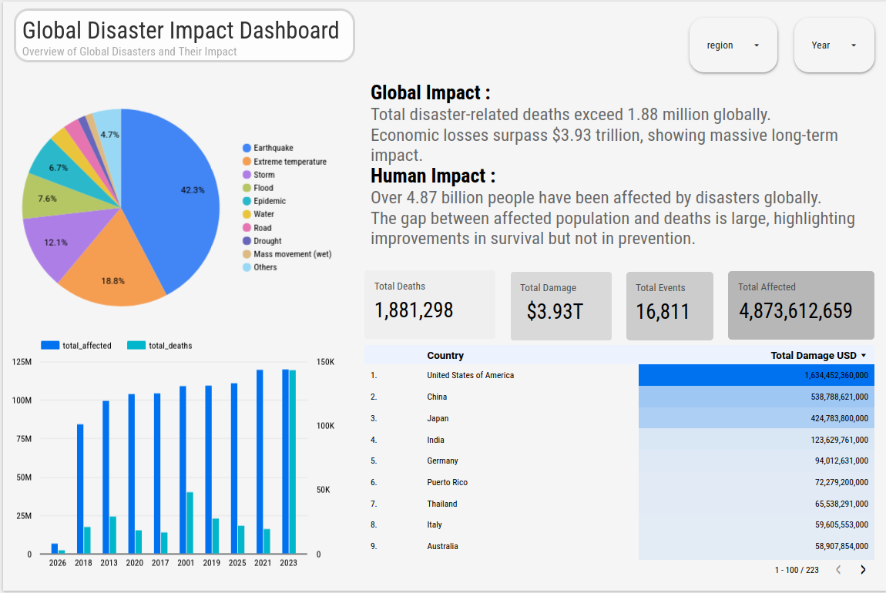
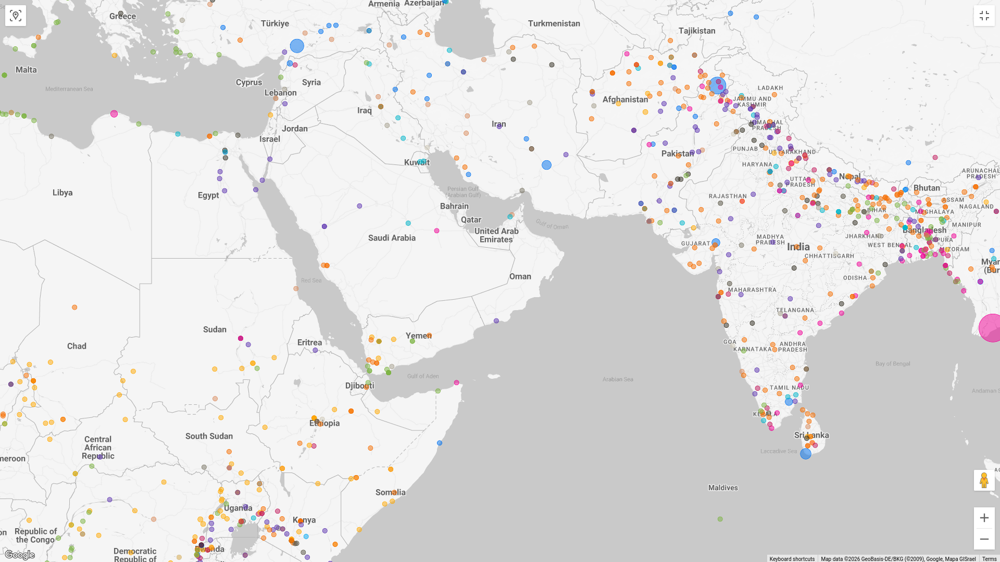

# Global Disaster Impact Analysis

A data analytics project focused on analyzing global disaster trends, human impact, and economic losses using SQL and interactive dashboards.

---

## Overview

This project transforms raw disaster data into structured insights to understand how disasters impact different regions across the world.

It demonstrates:

* Data cleaning and transformation using SQL
* Analytical querying on real-world data
* Dashboard development for insight-driven analysis

---

## Preview

### Overview Dashboard



### Geospatial Analysis



---

## Data Pipeline

<div align="center">

EM-DAT Raw Dataset  
↓  
MySQL (disasters_raw)  
↓  
Data Cleaning & Transformation  
↓  
Structured Table (disasters)  
↓  
Looker Studio Dashboard  
↓  
Insights & Analysis  

</div>


## Data Cleaning & Preparation

To ensure accurate and reliable analysis, the raw dataset was transformed into a structured, analysis-ready format through the following steps:

* Converted key fields from text to numeric types (`total_deaths`, `total_affected`, `total_damage_usd`)
* Normalized economic damage values from `'000 US$` to standard USD
* Standardized column names to a consistent `snake_case` format
* Extracted and created a dedicated `year` column for time-based analysis
* Handled missing and null values in critical fields to prevent aggregation errors
* Cleaned and aligned geographic data (`country`, `location`) for accurate mapping


## Key Insights

* Disaster impact is concentrated in specific high-risk regions
* Earthquakes contribute significantly to total fatalities
* Economic losses reach trillions of USD globally
* Disaster frequency shows an increasing trend over time


## Project Structure

```text
├── dashboard/ 
│   ├── dashboard.png 
│   ├── map.png 
│   ├── overview.md 
│   └── map.md 
│ ├── data/ 
│   └── disasters_clean.csv 
│ ├── insights/ 
│   └── key_findings.md 
│ ├── sql/ 
│   └── 01_data_cleaning.sql 
│ └── README.md
```

---

## Notes

* Dataset sourced from EM-DAT (International Disaster Database)
* Economic damage values converted from `'000 US$` to USD
* Data cleaned and standardized for analysis
